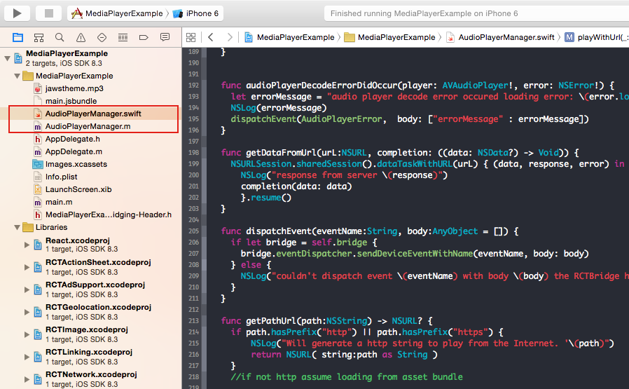

# React Native MediaPlayer

Simple player for playing Audio and Movies

## AudioPlayer

To use in react project first install

    npm install react-native-media-player --save

To get the Native AudioPlayer functionality.
Include files `AudioPlayerManager.m` and `AudioPlayerManager.swift` from
`node_modules/react-native-media-player/` into your Xcode project

The AudioPlayer component can then be included in your Javascript

	var AudioPlayer = require('react-native-media-player');
	
### Audiplayer Functions

#### Play
	/**
	** @param filePath -file path is a name of a file available as part of your resources or the URL to a media file
	* @param loop - optional boolean if set to true will loop the audio file. default is false
	**/
	play(filePath: String, loop:Boolean) -> () 
	
#### Pause

	/**
	* Pauses the current playing track in the player
	**/
	pause() -> ()

#### Stop
	/**
	* Stops the current playing track
	**/
	stop() -> ()

###AudioPlayer Events

#### onPlayerStarted

Event fired when the player starts playing a track
	
	/**
	*/
	onPlayerStarted({resumedPlaying: Boolean, startTime: Int})

#### onPlayerError 

#### onPlayerProgress

#### onPlayerFinished

##TODO

- Implement Video playback
  -- Playback should be able to set view size of Video
- Implement and Test Looping functionality
